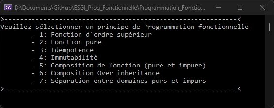
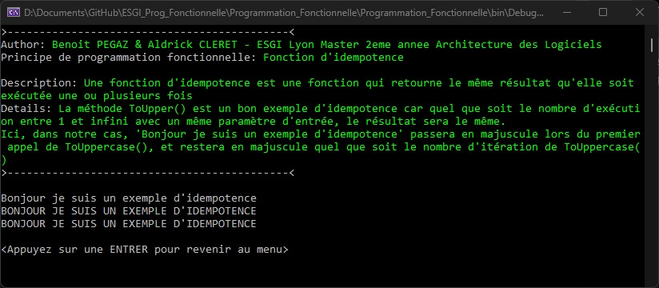

# ESGI Prog Fonctionnelle

Auteur: `Benoit PEGAZ` & `Aldrick CLERET`.  

Ce repo contient un projet console .NET6.  

Ouvrez la solution avec un éditeur de code (de préférence Visual Studio) et exécutez le fichier `Program.cs`.

Une console s'affiche avec un menu (liste de tous les principes implémentés):  

Saisissez le principe que vous souhaitez visionner en écrivant son numéro et en validant avec la touche Entrer.  
Exemple: Pour visionner l'idempotence, saisissez `3` puis appuyez sur `Entrer`.

L'affichage explique le principe demandé:

Pour revenir au menu principal, appuyez à nouveau sur la touche `Entrer`.